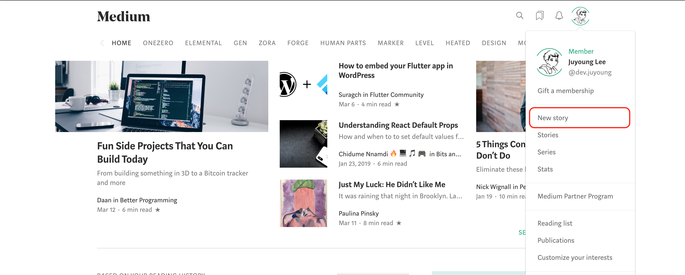
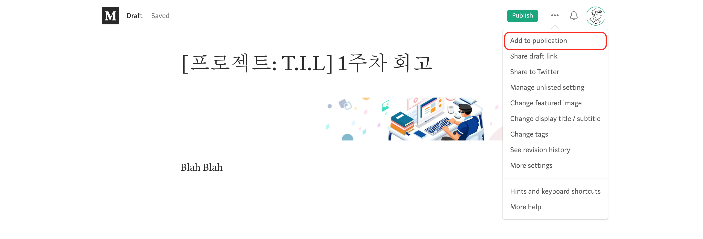
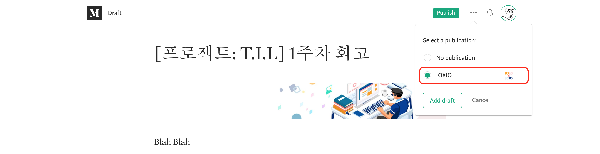
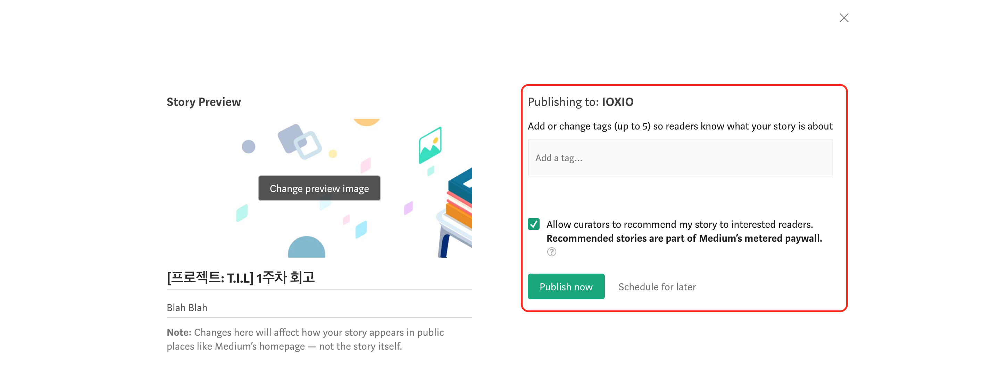
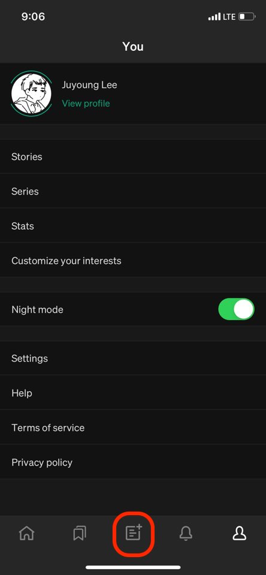
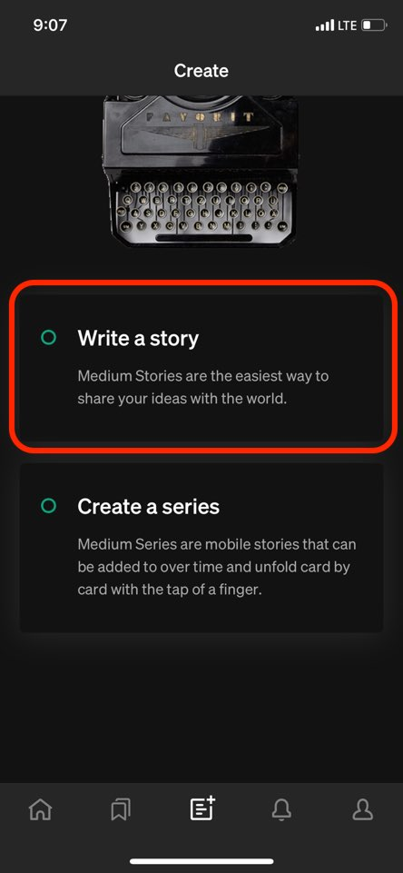
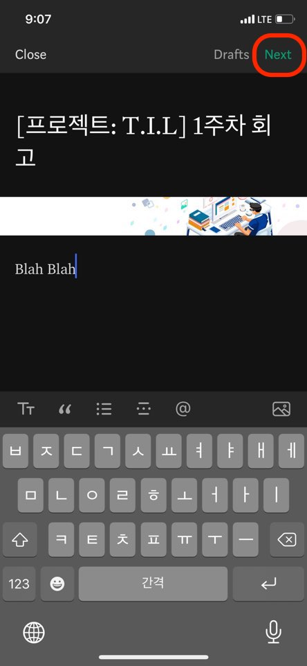
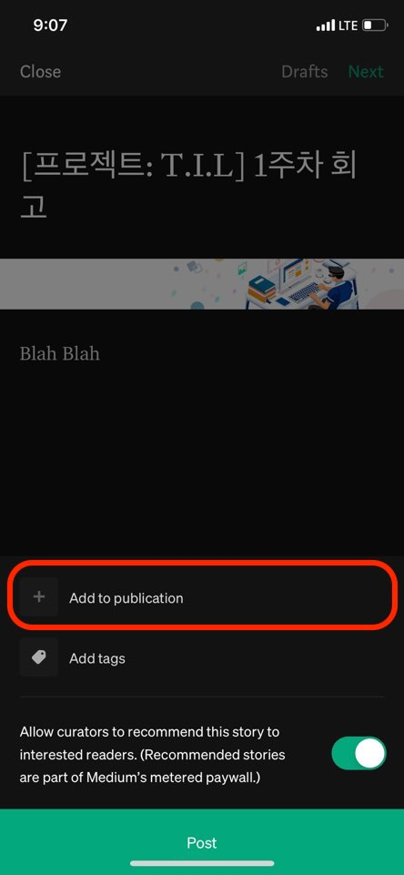
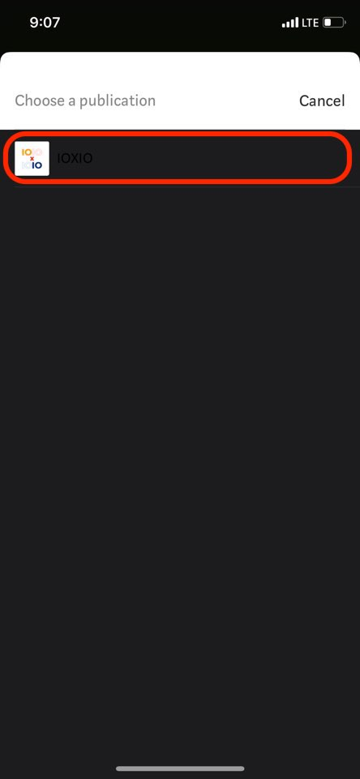
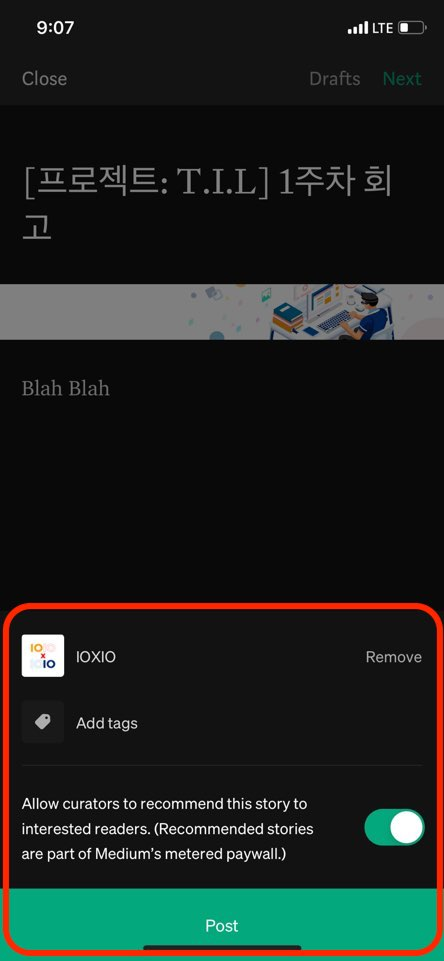

### 프로젝트 회고록 관련

- 일주일 동안 프로젝트를 진행했던 내용에 대하여 회고록을 작성한다.
- 회고록은 매주 일요일까지 작성하여 미디엄 Publication으로 Draft 버전을 Publish 한다.
- 회고록의 양식은 자유양식이며, 필요 또는 요청에 따라 특정 템플릿으로 지정할 수도 있다.

### Web

#### #. 새 글 작성

#### #. 작성 글 Publication 추가

### #. 대상 Publication 선택

#### #. 작성 글 Publish

---

### Mobile App

#### #. 새 글 작성

#### #. 작성 글 Publication 추가

#### #. 작성 글 Publish

